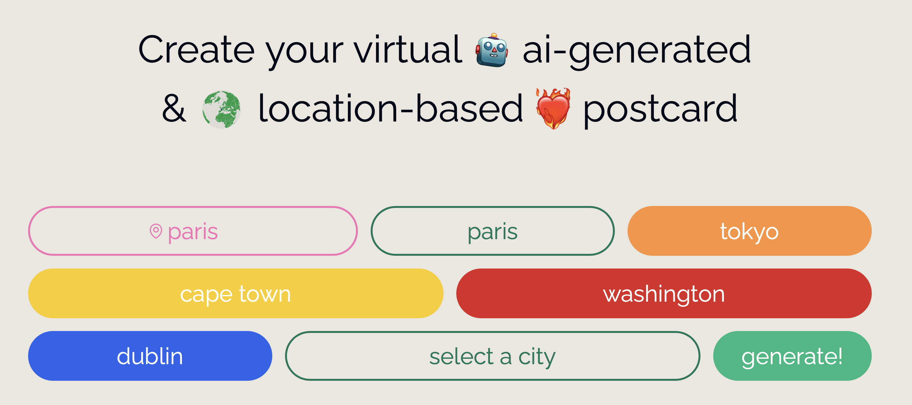

<a href="https://www.postai.enzo.codes">
  
  <h1 align="center">Postai</h1>
</a>

  Design and send AI-crafted, location-based virtual postcards.Powered by Vercel and Replicate.

  
  
    

  <a href="#tech-stack"><strong>Tech Stack</strong></a> ·
  <a href="#author"><strong>Author</strong></a>

 

## Tech Stack

- Next.js [App Router](https://nextjs.org/docs/app)
- Next.js [Server Actions](https://nextjs.org/docs/app/api-reference/functions/server-actions)
- [Vercel Blob](https://vercel.com/storage/blob) for image storage
- [Vercel Postgres](https://vercel.com/storage/vercel-postgres) for user data storage
- [Vercel KV](https://vercel.com/storage/kv) for redis

## Author

- Enzo Bacqueyrisses ([@bacqueyrisses](https://twitter.com/bacqueyrisses))
